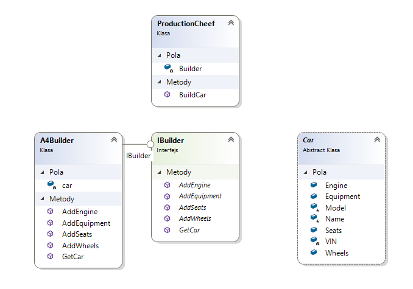

# Lekcja 13

## 1. Introduction

In this lesson we will present the **Builder** and **Factory** pattern or, in fact, its varieties - **Factory method (manufacturing method)**.

I refer to this [article in Wikipedia](https://pl.wikipedia.org/wiki/Wzorzec_projektowy_(informatics)), which can be a point of attachment to the history of the creation of the concept of design pattern in informatics
 and the division of patterns and representatives of the various groups. It's also worth knowing who the **Gang of Four (GoF)** members were.

## 2. Builder pattern

This pattern is one of the creation patterns. It is used to change the way of creating objects from many overloaded contructors on a chain of methods, building an object (called a composite) element after an element.
In the **Builder** pattern, which is supposed to build the final _product_  (according to the description provided by GoF) there is still an object **of the manager, director or supervisor**,
who is ordering the construction of a particular product to a concrete builder.
As an example of a solution to show how to implement this pattern we will use car_"builders"_.
Let's remember about the SOLID rules and the fact that we always try to build some kind of a scaffold, interface and abstraction that will be able to
extend by adding new implementations (abstract classes, interfaces - builders in this particula example) and not by modifying the application backbone.

Here, the elements of our skeleton will mainly be the **IBuilder** interface (which is a component resulting from the very definition of the pattern) and 
a Car class that will provide consistent, general characteristics and behaviour for all our cars.
The diagram below should shed some more light on this pattern.


It is worth knowing that implementation of the Builder pattern can take many forms. The currently discussed form does not provide the possibility of executing a chain of methods to build a final object (e.g. Car.AddWheels().AddEngine()).
This approach is called **a static builder** and is often implemented in this form.
You still need specific builders who will know how to build a specific car model.
Below there is a sample implementation of the builder's interface:


```csharp
public interface IBuilder
    {
        void AddSeats();
        void AddWheels();
        void AddEquipment();
        void AddEngine();
        Car GetCar();
    }
```
This may be the implementation of the **Supervisor**, who orders to build a particular product:
```csharp
public class ProductionCheef
    {
        readonly IBuilder Builder;

        public Car BuildCar(IBuilder builder) {
            builder.AddEngine();
            builder.AddSeats();
            builder.AddWheels();
            builder.AddEquipment();

            return builder.GetCar();
        }
    }
```

The Car class, which is our product:
```csharp
public abstract class Car
    {
        protected string Name;
        protected string Model;
        readonly string VIN;
        public string Wheels;
        public string Seats;
        public string Engine;
        public List<string> Equipment;
    }
```

And a concrete builder:

```csharp
public class A4Builder : IBuilder
    {
        private Car car = new AudiA4();

        public void AddEngine()
        {
            car.Engine = "Klasyczny 136 konny Diesel";
        }

        public void AddEquipment()
        {
            car.Equipment = new List<string>();
            car.Equipment.Add("Standardowe radio CD");
            car.Equipment.Add("Lakier matowy, kolor biały");
        }

        public void AddSeats()
        {
            car.Seats = "Klasyczne fotele. Kolor szaro-czarny";
        }

        public void AddWheels()
        {
            car.Wheels = "16 calowe stalowe felgi. Opona 205/55 Continental.";
        }

        public Car GetCar()
        {
            return car;
        }
    }
```

## 3. Factory method


The manufacturing method is a variant of the Factory Patternthat allows you to create one entry point to create different 
specific objects of a given type (most often implementing a given interface). 
I decided to use the example presented [in this article](https://blog.helion.pl/wzorzec-projektowy-metoda-wytworcza/), which perfectly
fits in for our case study. The code has been changed so that it is a simple engine factory for our car builders. The code is in the **factory** subfolder in this branch of the repository.
It is particularly noteworthy to notice the usage of a dictionary as a container that returns new instances of objects based on a parameter transferred to the factory.

```csharp
public interface IEngineFactory
{
    IEngine MakeEngine(string name);
}

public class EngineFactory : IEngineFactory
{
    private readonly Dictionary<string, IEngine> engines = new Dictionary<string, IEngine>()
    {
        { "diesel standard", new Diesel136HP() },
        { "diesel automat", new Diesel190HP() },
        { "benzyna biturbo", new Biturbo240HP() }
    };

    public IEngine MakeEngine(string name)
    {
        IEngine car;
        this.engines.TryGetValue(name, out engine);
        return engine;
    }
}
```


